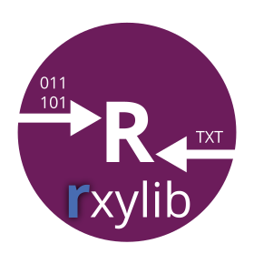

<!-- README.md was auto-generated by README.Rmd. Please DO NOT edit by hand!-->

# rxylib 

The **R** package `rxylib` provides and access to the C++ library
[xylib](https://xylib.sourceforge.net) by wrapping the library using
Rcpp. For supported data formats see <https://github.com/wojdyr/xylib>.

[](https://CRAN.R-project.org/package=rxylib)
[](https://www.r-pkg.org/pkg/rxylib)
[](https://github.com/R-Lum/rxylib/actions)
[](https://zenodo.org/badge/latestdoi/95584252)
[](https://app.codecov.io/gh/R-Lum/rxylib)

## Installation

#### i. Requirements

- *Windows (32/64bit)*:
  [Rtools](https://cran.r-project.org/bin/windows/Rtools/) (provided by
  CRAN)
- *macOS*: [Xcode](https://developer.apple.com/xcode/)
- *Linux*: [gcc](https://gcc.gnu.org) often comes pre-installed in most
  distributions.

#### ii. Install the package (development version)

To install the stable version from CRAN, simply run the following from
an R console:

``` r
install.packages("rxylib")
```

To install the latest development builds directly from GitHub, run

``` r
if(!require("devtools"))
  install.packages("devtools")
devtools::install_github("R-Lum/rxylib@master")
```

To install a developer build other than `'master'`, replace the term
`'master'` in the code line by the name of the wanted developer build.

## Related projects

- [rxylibShiny](https://github.com/JohannesFriedrich/rxylibShiny)

# Licenses

Please note that the package uses two different licences

## Package `rxylib` license

This program is free software: you can redistribute it and/or modify it
under the terms of the GNU General Public License as published by the
Free Software Foundation, either version 3 of the License, or any later
version.

This program is distributed in the hope that it will be useful, but
WITHOUT ANY WARRANTY; without even the implied warranty of
MERCHANTABILITY or FITNESS FOR A PARTICULAR PURPOSE. See the [GNU
General Public
License](https://github.com/R-Lum/rxylib/blob/master/LICENSE) for more
details.

## Library `xylib` license

The library itself is **NOT** part of the GPL-3 license conditions of
the package and available under
[LGPL](https://github.com/wojdyr/xylib/blob/master/COPYING) license
conditions only cf. <https://github.com/wojdyr/xylib>

## <span class="glyphicon glyphicon-euro"></span> Funding

- Between 2017-2019, the work of Sebastian Kreutzer as maintainer of the
  package was supported by LabEx LaScArBx (ANR - n. ANR-10-LABX-52).

- From 01/2020-04/2022, Sebastian Kreutzer received funding from the
  European Union’s Horizon 2020 research and innovation programme under
  the Marie Skłodowska-Curie grant agreement No 844457 (project:
  CREDit).
