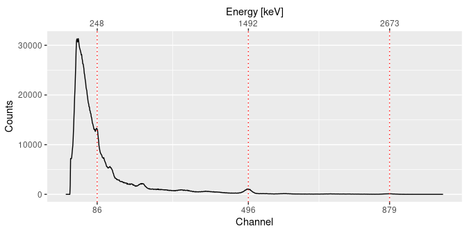
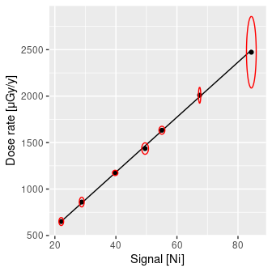

<!-- README.md is generated from README.Rmd. Please edit that file -->

# gamma 

<!-- badges: start -->

[](https://github.com/crp2a/gamma/actions/workflows/R-CMD-check.yaml)
[](https://app.codecov.io/gh/crp2a/gamma)

<a href="https://crp2a.r-universe.dev" class="pkgdown-devel"></a>
<a href="https://cran.r-project.org/package=gamma"
class="pkgdown-release"></a>
<a href="https://cran.r-project.org/web/checks/check_results_gamma.html"
class="pkgdown-release"></a>
<a href="https://cran.r-project.org/package=gamma"
class="pkgdown-release"></a>

[](https://www.repostatus.org/#active)

[](https://doi.org/10.5281/zenodo.2652393)
[](https://archive.softwareheritage.org/swh:1:dir:459ecf47c4c0bb768732bd56c5c245ddab0d33f9;origin=https://github.com/crp2a/gamma;visit=swh:1:snp:10e6be6e5cbe735b58c45abbcbabf20b93019e9c;anchor=swh:1:rev:1b3baf8821267ed656d780ae154d347769141d0c/)
<!-- badges: end -->

## Overview

**gamma** is intended to process in-situ gamma-ray spectrometry
measurements for luminescence dating. This package allows to import,
inspect and (automatically) correct the energy scale of the spectrum. It
provides methods for estimating the gamma dose rate by the use of a
calibration curve. This package only supports Canberra CNF and TKA
files.

The [**gammaShiny**](https://github.com/crp2a/gammaShiny) package
provides an enhanced graphical user interface for the main applications
of **gamma**.


    To cite gamma in publications use:

      Lebrun, Brice, Nicolas Frerebeau, Guilhem Paradol, Guillaume Guérin,
      Norbert Mercier, Chantal Tribolo, Christelle Lahaye, and Magalie
      Rizza. 2020. Gamma: An R Package for Dose Rate Estimation from
      In-Situ Gamma-Ray Spectrometry Measurements. Ancient TL 38 (2): 1-5.

    Une entrée BibTeX pour les utilisateurs LaTeX est

      @Article{,
        title = {Gamma: An R Package for Dose Rate Estimation from In-Situ Gamma-Ray Spectrometry Measurements},
        author = {Brice Lebrun and Nicolas Frerebeau and Guilhem Paradol and Guillaume Guérin and Norbert Mercier and Chantal Tribolo and Christelle Lahaye and Magali Rizza},
        year = {2020},
        journal = {Ancient TL},
        volume = {38},
        number = {2},
        pages = {1-5},
      }

## Installation

You can install the released version of **gamma** from
[CRAN](https://CRAN.R-project.org) with:

``` r
install.packages("gamma")
```

Or install the development version from
[R-universe](https://crp2a.r-universe.dev/) with:

``` r
install.packages("gamma", repos = "https://crp2a.r-universe.dev")
```

## Usage

``` r
## A minimal example
library(gamma)
library(magrittr)

## Find the full path to the spectrum file
spc_file <- system.file("extdata/LaBr.CNF", package = "gamma")
## Import the spectrum
spectrum <- read(spc_file)

## Set the expected channel/energy peaks for the energy scale calibration
## Spectrum pre-processing and peak detection
peaks <- spectrum %>%
  signal_slice() %>%
  signal_stabilize(f = sqrt) %>%
  signal_smooth(method = "savitzky", m = 21) %>%
  signal_correct(method = "SNIP", n = 100) %>%
  peaks_find()

## Set the energy values (in keV)
set_energy(peaks) <- c(238, NA, NA, NA, 1461, NA, NA, 2615)

## Calibrate the energy scale
calib <- energy_calibrate(spectrum, peaks)

## Inspect peaks
plot(calib, peaks)
```



``` r
## Estimate the gamma dose rate of a set of spectra
## You may want to give extra attention to the energy calibration step
spc_file <- system.file("extdata/BDX_LaBr_1/test", package = "gamma")
spectra <- read(spc_file)

## Load the calibration curve for the dose rate estimation
## As this curve is instrument specific, you will have to build your own
## See help(fit_dose)
data("BDX_LaBr_1", package = "gamma")
plot(BDX_LaBr_1)
```



``` r

## Estimate the gamma dose rate
(doses <- dose_predict(BDX_LaBr_1, spectra))
#>            names   dose_Ni  error_Ni dose_NiEi error_NiEi
#> 1 20110523204008  252.2866 12.385847  220.6747   4.393262
#> 2 20110523210008  257.3316 10.527417  219.1303   4.357479
#> 3 20110527205316  247.5890  8.296925  203.0288   4.033624
#> 4 20130809172451  892.1003 22.333994  849.8817  16.868056
#> 5 20130813181639 1065.0899 26.314061 1024.9325  20.341807
#> 6 20160717175757  565.6418 19.579056  496.7518   9.869339
#> 7 20160717181052  480.1928 15.805970  421.8396   8.379351
#> 8 20160717182601  497.7403 15.232673  436.2712   8.663842
```

## Contributing

Please note that the **gamma** project is released with a [Contributor
Code of
Conduct](https://github.com/crp2a/gamma/blob/master/.github/CODE_OF_CONDUCT.md).
By contributing to this project, you agree to abide by its terms.

## Acknowledgements

This work received a state financial support managed by the Agence
Nationale de la Recherche (France) through the program *Investissements
d’avenir* (ref. [10-LABX-0052](https://lascarbx.labex.u-bordeaux.fr) and
[11-IDEX-0001](https://www.univ-amu.fr/amidex)).
